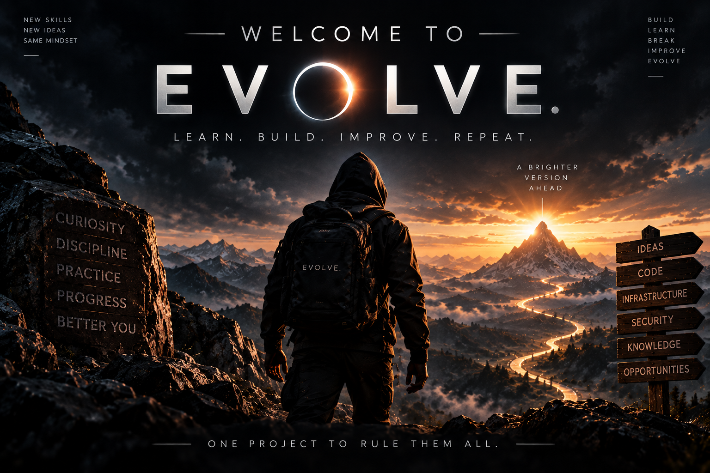

## Evolve: One Project to Learn Everything

**Evolve is my project to learn everything:** software engineering, platform engineering, security and ethical hacking, data engineering, DevSecOps, AI, and whatever I explore next.

I manage and build Evolve using real engineering practices: planning, issues, reviews, documentation, experimentation, and continuous improvement. What I build will evolve as I learn. The long-term direction includes turning my portfolio into a free technology learning hub where I can share what I know.

Self-study notes live in the [study space](study/README.md), alongside the rest of the journey.

---

**Learn. Build. Break. Fix. Evolve.**